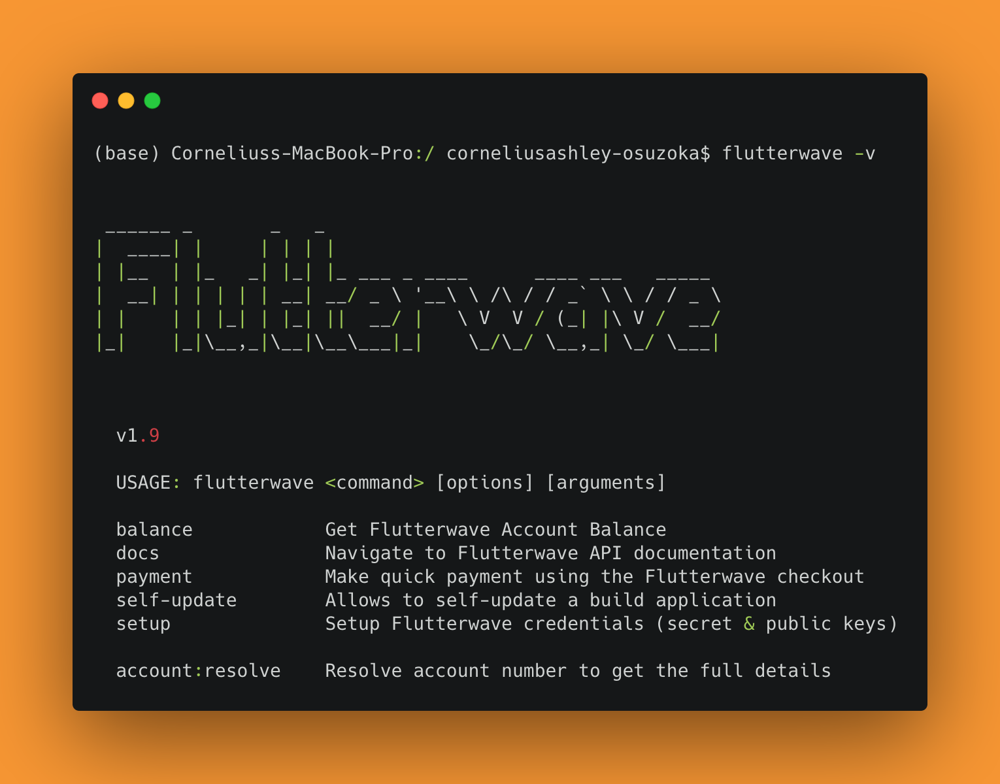

<p align="center">
    
</p>

## Flutterwave CLI
The Flutterwave CLI application helps you tests some features of Flutterwave on the go and also generate sample applications that shows you the simplest and easy way of how these features work and how to implement them into your own application or platform.

<p align="center">
    
</p>

## Setup:
1. Ensure you have composer installed on your computer. You can confirm this by running `composer -v` from your terminal. If you don't have it installed, you can download and install it using the [Composer](https://getcomposer.org/download/) docs.
2. After successful installation of composer, run the command on your terminal `composer global require emmajiugo/flutterwave-cli` to require it globally
3. Run on your terminal `flutterwave -v` to view the available commands.  
**NB:** If you  get the error `command not found`, don't worry ;) it is not an error, visit this [stackoverflow page](https://stackoverflow.com/questions/63020670/flutterwave-command-not-working-flutterwave-cli) to read how you can configure/fix it.
4. Setup your CLI by adding your Flutterwave keys (Test and Live).  
Run `flutterwave setup`.  
<!-- Run `flutterwave setup --mac`.   -->
**NB:** This is a one time setup and your keys are stored in your computer and not sent to any server.  
<!-- For the CLI to setup the ENV properly, you need to identify your system by passing `--mac` or `--windows` tag.  
Support for other OS is upcoming. -->

## Usage:

```
NOTE: To use your LIVE credential when making a call,  
add the LIVE tag (--live) to all your commands.
```

### Quickly Open API Documentation for a Feature
Quickly navigate to our API documentation for any Flutterwave feature using this command `flutterwave docs --feature=webhook`.  
To see all feature, run the command `flutterwave docs`.

### Account Resolve
You can quickly resolve an account number using the CLI.  
Run `flutterwave account:resolve accountNumber bankCode --live`  
NB: You can get Bank codes using the CLI. Read how you can achieve that below.  

### Check Flutterwave Balance
You can quickly know your balances without logging into the dashboard.  
Run `flutterwave balance`.  
To get by currency, run the command `flutterwave balance --currency=NGN` (e.g. NGN, GHS, USD, EUR etc).

### Get Bank and Bank Codes
Get Banks and their bank codes.  
Run `flutterwave bank:list country`. The `country` should be replaced with NG, GH, KE, UG, ZA or TZ.

### Get Bank Branches
Get Banks and their branches.  
Run `flutterwave bank:branch ID`. The `ID` is returned when listing all banks.

### Verify Card BIN
Get information about a card.  
Run `flutterwave card:bin BIN`. The `BIN` should be replaced with the first 6 six digits on a debit/credit card.

### Forex Rate
Get Forex rate used by Flutterwave.  
Run `flutterwave fx:rate --amount=100 --from=USD --to=NGN`.

### Make Quick Payment
Make a quick payment using the Flutterwave modal. The command will open up the Flutterwave modal in your browser with the information passed.  
Run `flutterwave payment e@x.com 100 --currency=NGN`.

### Transaction Verification
Quickly verify a transaction to get the final status of the transaction.  
Run `flutterwave transaction:verify ID`.  The transaction `ID` is the `data.id` param from the charge response.

<!-- ### Make Quick Transfer  -->
### Resend Failed Webhook
You can quickly resend a failed webhook to your webhook URL added in your Flutterwave dashboard.  
Run `flutterwave webhook:resend ID`. The `ID` is the transaction unique identifier. It is returned in the initiate transaction call as `data.id`.

### Ping Webhook To LocalHost
This is one of the simplest ways to test webhook without exposing your localhost to the web.  
You can use this command to quickly test for webhook during development.  
Run `flutterwave webhook:ping ID WEBHOOK-URL --event=transfer --hash=password1`.   
The transaction `ID` from `data.id`.  
The `WEBHOOK-URL` should be replaced with your webhook url for testing purpose (`localhost:8080/flutterwave/webhook`).  
The `--event=` should be `transfer|card`.  
The `--hash=` is your test secret hash.

### Generate Sample Apps
To generate sample apps, run `flutterwave generate:app`.   
This command will list all available or future support of sample apps. E.g (`flutterwave generate:app modal`) the following command will generate the sample for Flutterwave modal.  
The current supported sample apps are:  
- `3DSecure`
- `Charge`
- `DB Logging`
- `Extra-Info` i.e. passing extra information to Flutterwave
- `Flutterwave Modal` i.e. Inline, Standard setup
- `Split Payment`
- `Tokenized Charges`
- `Transfers`
- `Webhook`

 
Chigbo Ezejiugo  
emmajiugo@gmail.com
